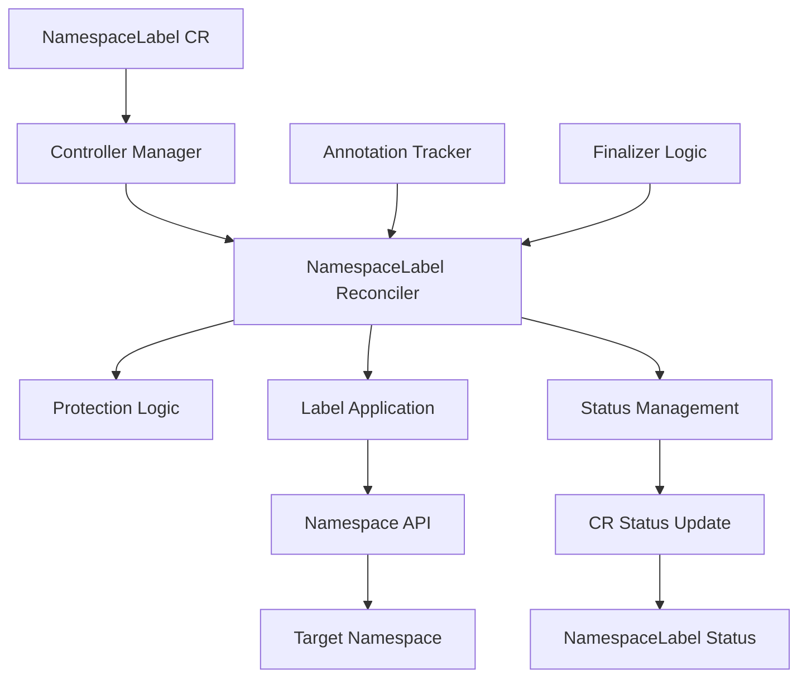

# NamespaceLabel Operator Architecture

This document provides a detailed overview of the NamespaceLabel operator's architecture, design decisions, and implementation details.

## Overview

The NamespaceLabel operator is a Kubernetes controller that manages namespace labels through custom resources. It follows the standard Kubernetes operator pattern with additional safety mechanisms for multi-tenant environments.

## High-Level Architecture



## Core Components

### 1. Controller Manager

Built on the Kubebuilder framework using controller-runtime:

- **Manager**: Orchestrates all controllers and manages shared resources
- **Webhook Server**: Handles admission webhooks (extensible for future validation)
- **Metrics Server**: Exposes Prometheus metrics
- **Health Probes**: Provides readiness and liveness endpoints

### 2. NamespaceLabel Reconciler

The main controller implementing the reconciliation logic:

```go
type NamespaceLabelReconciler struct {
    client.Client
    Scheme *runtime.Scheme
}
```

**Key Responsibilities:**
- Watch NamespaceLabel custom resources
- Validate singleton pattern (only "labels" name allowed)
- Apply protection logic
- Manage namespace labels
- Update status and conditions
- Handle finalizers for cleanup

### 3. Protection System

A sophisticated system to prevent overwriting critical management labels:

```go
type ProtectionResult struct {
    AllowedLabels    map[string]string
    ProtectedSkipped []string
    Warnings         []string
    ShouldFail       bool
}
```

**Components:**
- **Pattern Matcher**: Uses Go's `filepath.Match` for glob patterns
- **Protection Modes**: Skip, warn, or fail behaviors
- **Existing Label Detection**: Respects previously applied labels
- **Annotation Tracking**: Maintains state for safe cleanup

## Design Patterns

### 1. Singleton Pattern

Each namespace can only have one NamespaceLabel CR named "labels":

```yaml
metadata:
  name: labels  # Enforced by controller
  namespace: target-namespace
```

**Benefits:**
- Prevents conflicts between multiple CRs
- Simplifies RBAC (tenants know the resource name)
- Clear ownership model
- Easier troubleshooting

**Implementation:**
```go
if exists && current.Name != StandardCRName {
    // Reject non-standard names
    updateStatus(&current, false, "InvalidName", message)
    return ctrl.Result{}, nil
}
```

### 2. Namespace Isolation

Security through namespace-scoped operation:

```go
// Target namespace is always the same as the CR's namespace
targetNS := req.Namespace
```

**Security Benefits:**
- Tenants can only affect their own namespace
- Prevents privilege escalation
- Clear security boundaries
- Supports multi-tenant clusters

### 3. Reconciliation Loop

Standard Kubernetes controller pattern:

```
┌─────────────────┐
│   Watch Events  │
└─────────┬───────┘
          │
          ▼
┌─────────────────┐    ┌─────────────────┐
│   Reconcile     │◄──►│   Requeue       │
│   Function      │    │   on Error      │
└─────────┬───────┘    └─────────────────┘
          │
          ▼
┌─────────────────┐
│  Update Status  │
└─────────────────┘
```

## State Management

### 1. Annotation-Based Tracking

The operator tracks applied labels using namespace annotations:

```yaml
metadata:
  annotations:
    labels.shahaf.com/applied: '{"environment":"production","team":"backend"}'
```

**Purpose:**
- Enable safe label removal
- Detect external changes
- Support multiple operators
- Audit trail for changes

### 2. Finalizer Management

Ensures clean shutdown and label cleanup:

```go
const FinalizerName = "labels.shahaf.com/finalizer"
```

**Lifecycle:**
1. Finalizer added when CR created
2. Prevents deletion until cleanup complete
3. Removes operator-managed labels
4. Finalizer removed, allowing CR deletion

### 3. Status Reporting

Comprehensive status information:

```go
type NamespaceLabelStatus struct {
    Applied                   bool              `json:"applied,omitempty"`
    Message                   string            `json:"message,omitempty"`
    Conditions               []metav1.Condition `json:"conditions,omitempty"`
    ProtectedLabelsSkipped   []string          `json:"protectedLabelsSkipped,omitempty"`
    LabelsApplied            []string          `json:"labelsApplied,omitempty"`
}
```

## Protection Logic Architecture

### 1. Pattern Matching System

```go
func isLabelProtected(labelKey string, protectionPatterns []string) bool {
    for _, pattern := range protectionPatterns {
        if matched, err := filepath.Match(pattern, labelKey); err == nil && matched {
            return true
        }
    }
    return false
}
```

**Features:**
- Glob pattern support (`*`, `?`, `[class]`)
- Multiple pattern evaluation
- Case-sensitive matching
- Error handling for invalid patterns

### 2. Protection Decision Tree

```
Label in Spec
     │
     ▼
Matches Protection Pattern?
     │                    │
    No                   Yes
     │                    │
     ▼                    ▼
Apply Label      Check Protection Mode
                          │
                 ┌────────┼────────┐
                 │        │        │
                Skip     Warn     Fail
                 │        │        │
                 ▼        ▼        ▼
            Silent Skip  Log + Skip  Error
```

### 3. Configuration Merging

When multiple CRs exist (during transitions):

```go
// Use the most restrictive protection mode from all CRs
if cr.Spec.ProtectionMode == labelsv1alpha1.ProtectionModeFail {
    protectionMode = labelsv1alpha1.ProtectionModeFail
} else if cr.Spec.ProtectionMode == labelsv1alpha1.ProtectionModeWarn && 
          protectionMode != labelsv1alpha1.ProtectionModeFail {
    protectionMode = labelsv1alpha1.ProtectionModeWarn
}
```

## Security Architecture

### 1. RBAC Design

**Controller Permissions:**
```yaml
rules:
- apiGroups: [""]
  resources: ["namespaces"]
  verbs: ["get", "list", "watch", "update", "patch"]
- apiGroups: ["labels.shahaf.com"]
  resources: ["namespacelabels"]
  verbs: ["get", "list", "watch", "create", "update", "patch", "delete"]
```

**Tenant Permissions:**
```yaml
# Pre-built ClusterRoles
- namespacelabel-editor-role   # Full CRUD access
- namespacelabel-viewer-role   # Read-only access
```

### 2. Admission Control

Future extensibility for validation webhooks:

```go
// Webhook server configured but not used yet
webhookServer := webhook.NewServer(webhook.Options{
    TLSOpts: tlsOpts,
})
```

**Planned Features:**
- Label validation rules
- Protection pattern validation
- Resource quotas and limits

### 3. Multi-Tenancy

**Isolation Mechanisms:**
- Namespace-scoped operation only
- RBAC-based access control
- Resource name constraints
- Audit logging

## Performance Considerations

### 1. Reconciliation Efficiency

**Optimizations:**
- Only update namespace when changes detected
- Efficient annotation parsing/writing
- Minimal API calls
- Error handling with exponential backoff

```go
changed := false
for k, v := range actuallyDesired {
    if cur, ok := ns.Labels[k]; !ok || cur != v {
        ns.Labels[k] = v
        changed = true
    }
}
if changed {
    if err := r.Update(ctx, &ns); err != nil {
        return ctrl.Result{}, err
    }
}
```

### 2. Memory Management

**Strategies:**
- Minimal in-memory state
- Efficient data structures
- Garbage collection friendly
- Resource cleanup

### 3. Scaling Characteristics

**Horizontal Scaling:**
- Leader election for single active instance
- Shared-nothing architecture
- Stateless operation
- External state in annotations

## Observability

### 1. Logging

Structured logging with consistent format:

```go
l.Info("NamespaceLabel successfully processed",
    "namespace", current.Namespace, 
    "labelsApplied", appliedCount, 
    "labelsRequested", labelCount,
    "protectedSkipped", skippedCount)
```

### 2. Metrics

Standard controller-runtime metrics plus custom metrics:

- Reconciliation duration
- Error rates
- Protection events
- Label application counts

### 3. Events

Kubernetes events for major state changes:

- Label applications
- Protection violations
- Error conditions
- Status changes

## Error Handling

### 1. Transient Errors

**Strategy**: Retry with exponential backoff

```go
// Namespace API errors
if apierrors.IsNotFound(err) {
    return ctrl.Result{RequeueAfter: time.Minute}, nil
}
```

### 2. Permanent Errors

**Strategy**: Update status, don't retry

```go
// Invalid CR name
updateStatus(&current, false, "InvalidName", message)
return ctrl.Result{}, nil // Don't requeue
```

### 3. Protection Failures

**Strategy**: Based on protection mode

```go
switch protectionMode {
case labelsv1alpha1.ProtectionModeFail:
    return ctrl.Result{RequeueAfter: time.Minute * 5}, 
           fmt.Errorf("protected label conflict: %s", warnings)
}
```

## Future Architecture Considerations

### 1. Horizontal Pod Autoscaling

- Multiple controller instances
- Work distribution strategies
- Leader election improvements

### 2. Webhook Integration

- Validation webhooks for CRs
- Mutation webhooks for namespaces
- Policy enforcement points

### 3. Multi-Cluster Support

- Cross-cluster label synchronization
- Federated protection policies
- Central management interfaces

### 4. Advanced Protection

- Time-based protection windows
- User-based protection overrides
- Integration with policy engines (OPA, Kyverno)

## Testing Architecture

### 1. Unit Tests

- Controller logic testing
- Protection system validation
- Status update verification

### 2. Integration Tests

- End-to-end scenarios
- Multi-tenant validation
- Error condition testing

### 3. E2E Tests

- Full operator deployment
- Real cluster validation
- Performance testing

This architecture provides a robust, secure, and scalable foundation for namespace label management in Kubernetes environments. 